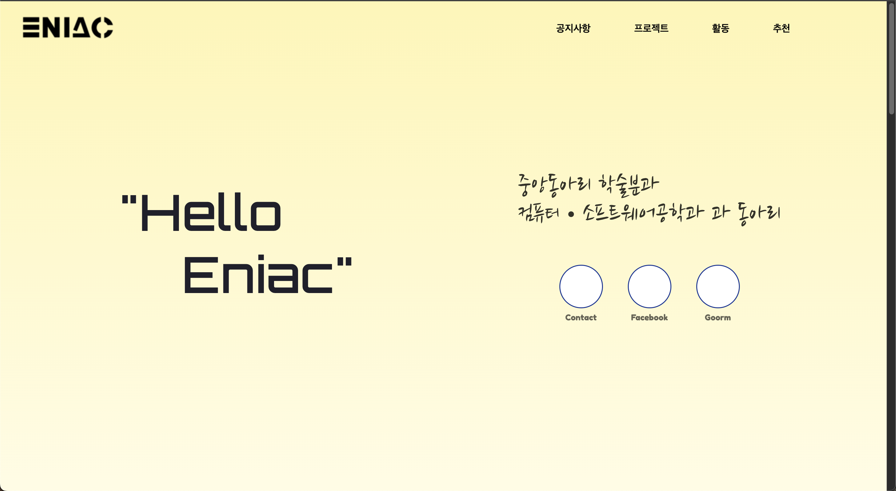
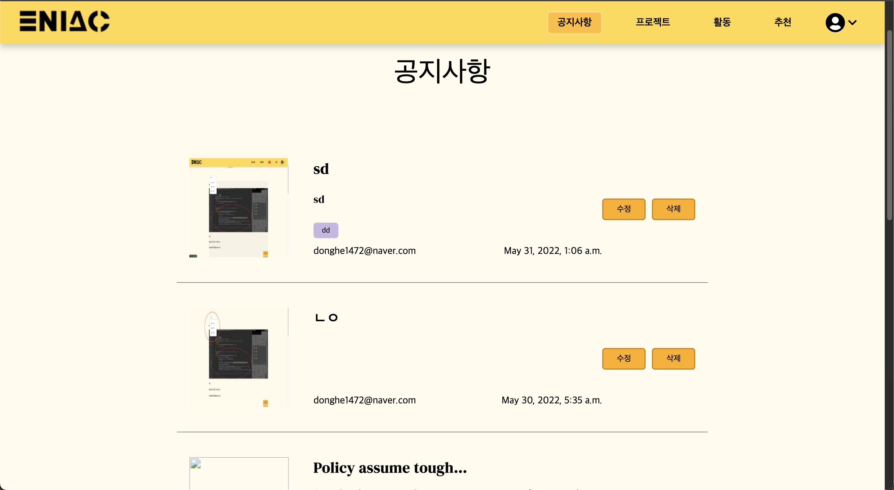
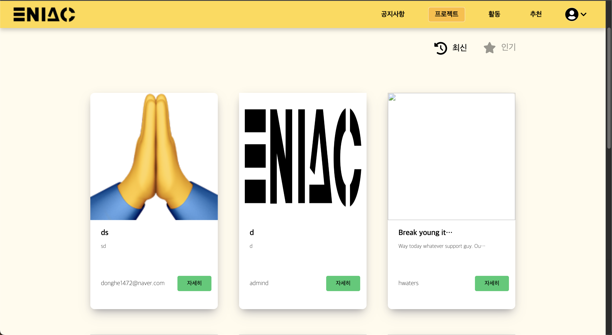
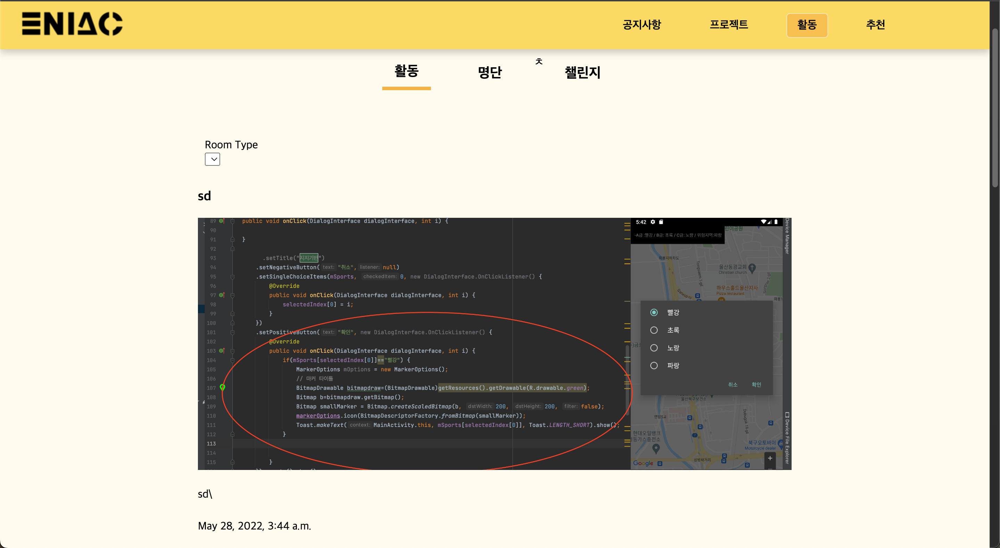
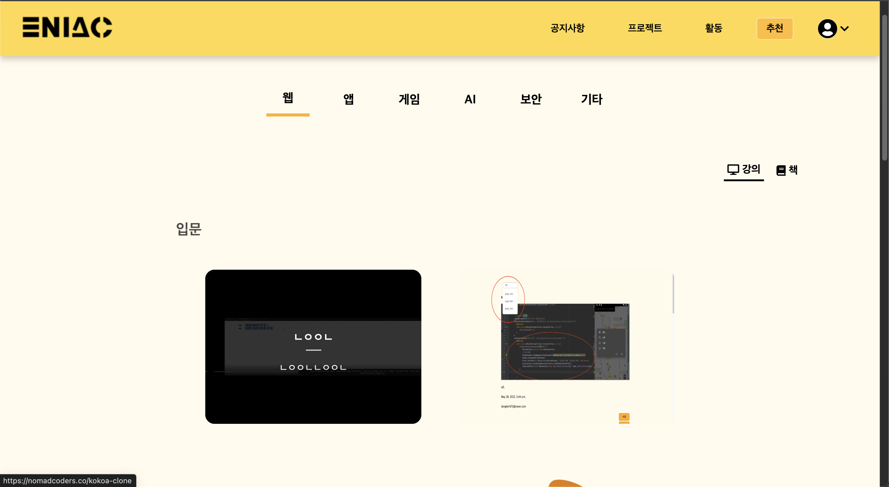

# Eniac Club Website

## 소개

에니악 홈페이지는 중앙대학교 컴퓨터 소프트웨어공학과 동아리인 에니악 회원들을 위해 제작된 웹사이트입니다. 이 웹사이트를 통해 동아리 활동을 체계적으로 관리하고, 회원 간의 소통을 원활하게 할 수 있습니다.

## 주요 기능

### 공지사항

- 동아리 공지사항을 게시하고, 회원들이 이를 확인할 수 있습니다.
- 공지사항에는 제목, 내용, 작성자, 작성일이 표시됩니다.
- 관리자는 공지사항을 수정하거나 삭제할 수 있습니다.

### 프로젝트

- 동아리 프로젝트를 게시하고, 회원들이 이를 확인할 수 있습니다.
- 프로젝트에는 제목, 설명, 작성자, 작성일이 표시됩니다.
- 각 프로젝트 카드에는 자세히 보기 버튼이 있어 프로젝트의 상세 내용을 확인할 수 있습니다.

### 활동

- 동아리 활동에 대한 게시글을 올리고, 회원들이 이를 확인할 수 있습니다.
- 활동 게시글에는 제목, 내용, 작성자, 작성일이 표시됩니다.
- 관리자는 활동 게시글을 수정하거나 삭제할 수 있습니다.

### 추천

- 회원들이 추천하는 강의, 책 등을 게시하고, 회원들이 이를 확인할 수 있습니다.
- 추천 항목에는 제목, 설명, 작성자, 작성일이 표시됩니다.

## 스크린샷

### 홈페이지 메인 화면



### 공지사항 페이지



### 프로젝트 페이지



### 활동 페이지



### 추천 페이지



## 설치 및 사용 방법

1. 저장소를 클론합니다.

   ```bash
   git clone https://github.com/your-repo/eniac-homepage.git
   cd eniac-homepage
   ```

2. 필요한 패키지를 설치합니다.

   ```bash
   pip install -r requirements.txt
   ```

3. 데이터베이스를 초기화합니다.

   ```bash
   python manage.py migrate
   ```

4. 서버를 실행합니다.

   ```bash
   python manage.py runserver
   ```

5. 웹 브라우저에서 [http://127.0.0.1:8000](http://127.0.0.1:8000) 으로 접속하여 홈페이지를 확인합니다.

## 기여 방법

1. 이 저장소를 포크합니다.
2. 새로운 브랜치를 만듭니다.
   ```bash
   git checkout -b feature/your-feature
   ```
3. 변경 사항을 커밋합니다.
   ```bash
   git commit -m 'Add some feature'
   ```
4. 브랜치에 푸시합니다.
   ```bash
   git push origin feature/your-feature
   ```
5. Pull Request를 생성합니다.

## 라이센스

이 프로젝트는 MIT 라이센스를 따릅니다. 자세한 내용은 `LICENSE` 파일을 참고하세요.

## 문의

프로젝트에 대한 문의 사항이 있으시면 donghe1472@gmail.com으로 연락해 주세요.
